# Mermaid Flowchart Format Specification

Version: 1.0

A visual format for rendering a code graph as a Mermaid flowchart
diagram. Produces standard Mermaid syntax compatible with GitHub, VS
Code, and mermaid.live.

Extension: `.mmd`

## Structure

```
%% zcodeprism mermaid -- {project_name}
%% {stats_summary}
%% generated {ISO-8601}

flowchart TB
    %% === Class definitions ===
    classDef ...
    ...

    %% === File subgraphs ===
    subgraph f_1["..."]
        ...
    end
    ...

    %% === Phantom subgraphs ===
    subgraph x_std["..."]
        ...
    end
    ...

    %% === Ghost nodes ===
    g_1["..."]
    ...

    %% === Edges ===
    ...

    %% === Class assignments ===
    class ... fn_style
    ...
```

## Header

The first three lines are Mermaid comments (`%%`) with metadata.

| Line | Format |
|------|--------|
| 1 | `%% zcodeprism mermaid -- {project_name}` |
| 2 | `%% {N} files, {N} functions, ...` |
| 3 | `%% generated {ISO-8601}` |

The flowchart uses top-to-bottom direction (`TB`).

## Mermaid IDs

Each entity gets an ID prefixed by kind, using underscores as separators
(colons are invalid in Mermaid IDs). The mapping from CTG IDs is direct:
`f:1` becomes `f_1`, `fn:3` becomes `fn_3`.

| Prefix | Kind | Example |
|--------|------|---------|
| `f_` | file | `f_1` |
| `ty_` | type_def | `ty_1` |
| `un_` | union_def | `un_1` |
| `en_` | enum_def | `en_1` |
| `fn_` | function | `fn_1` |
| `c_` | constant | `c_1` |
| `err_` | error_def | `err_1` |
| `t_` | test_def | `t_1` |
| `m_` | module | `m_1` |
| `x_` | external (phantom) | `x_1` |
| `g_` | ghost (scope boundary) | `g_1` |

## Node Shapes

| Kind | Shape | Mermaid Syntax | Label Pattern |
|------|-------|----------------|---------------|
| file | subgraph | `subgraph f_1["path"]` | relative file path |
| module | rounded rect | `m_1("mod: name")` | `mod: name` |
| function | rectangle | `fn_1["fn: name"]` | `fn: name` |
| type_def | subroutine | `ty_1[["struct: Name"]]` | `struct: Name` (Zig), `trait: Name` (Rust trait), `type: Name` (Rust alias) |
| union_def | double circle | `un_1(("union: Name"))` | `union: Name` |
| enum_def | hexagon | `en_1{{"enum: Name"}}` | `enum: Name` |
| constant | parallelogram | `c_1[/"const: name"/]` | `const: name` |
| test_def | stadium | `t_1(["test: name"])` | `test: name` |
| error_def | trapezoid | `err_1[/"error: Name"\]` | `error: Name` |

Methods use the label `fn: Parent.method` to distinguish them from
top-level functions.

Kinds `field`, `parameter`, and `import_decl` are omitted from the
diagram. Fields are accessible via MCP tools; imports are represented
by `imports` edges.

### Label Escaping

Special characters in labels are escaped for Mermaid syntax:
- `"` becomes `&quot;`
- `<` becomes `&lt;`
- `>` becomes `&gt;`

## Class Definitions (Styles)

One `classDef` per visual style, listed alphabetically. Each uses muted,
accessible colors.

```mermaid
classDef const_style fill:#e8d5f5,stroke:#7b2d8e,color:#4a1a5e
classDef en_style fill:#fef3cd,stroke:#c09853,color:#6d5a2e
classDef err_style fill:#e2e3e5,stroke:#6c757d,color:#3d4248
classDef fn_style fill:#d6eaf8,stroke:#2e6da4,color:#1a3d5c
classDef ghost_style fill:#ffffff,stroke:#cccccc,stroke-dasharray:3 3,color:#999999
classDef phantom_style fill:#f0f0f0,stroke:#999999,stroke-dasharray:5 5,color:#888888
classDef test_style fill:#f8d7da,stroke:#c0392b,color:#721c24
classDef ty_style fill:#d4edda,stroke:#28a745,color:#155724
classDef un_style fill:#e2d4f0,stroke:#7b2d8e,color:#4a1a5e
```

| Name | Kind | Color | Notes |
|------|------|-------|-------|
| `const_style` | constant | purple | |
| `en_style` | enum_def | yellow | |
| `err_style` | error_def | gray | |
| `fn_style` | function | blue | |
| `ghost_style` | ghost node | white | dashed border (3 3) |
| `phantom_style` | external | light gray | dashed border (5 5) |
| `test_style` | test_def | red | |
| `ty_style` | type_def | green | |
| `un_style` | union_def | violet | |

## Containment

### Files as subgraphs

Each file becomes a `subgraph` containing its top-level declarations.

### Modules

A module with children becomes a nested subgraph inside its file
subgraph. Nesting is limited to 2 levels: `file > module`.

### Methods

Methods live in the same file subgraph as their parent type, not in a
separate nested subgraph. They are distinguished by their
`Type.method` label.

### Example hierarchy

```
subgraph f_1["src/main.zig"]
    fn_1["fn: main"]
    fn_2["fn: parseFile"]
    c_2[/"const: version"/]
end

subgraph f_2["src/parser/tokenizer.zig"]
    ty_1[["struct: Tokenizer"]]
    fn_3["fn: Tokenizer.init"]
    fn_4["fn: Tokenizer.next"]
    en_1{{"enum: TokenKind"}}
    err_1[/"error: ParseError"\]
    t_1(["test: tokenizer handles empty input"])
end
```

## Edge Arrows

| Edge Type | Arrow | Style |
|-----------|-------|-------|
| `calls` | `-->` | solid |
| `uses_type` | `-->` | solid |
| `accesses_field` | `-->` | solid |
| `uses_value` | `-.->` | dotted |
| `imports` | `-.->` | dotted |
| `implements` | `==>` | thick |
| `contains` | `-->` | solid |

`similar_to` and `exports` edges are excluded from the diagram.

## Phantom Nodes

External dependencies and stdlib types are rendered outside file
subgraphs, grouped into a subgraph per top-level package.

```
subgraph x_std["std (stdlib)"]
    x_1_mem_Allocator["ext: mem.Allocator"]
    x_1_fs_Dir["ext: fs.Dir"]
end

subgraph x_tree_sitter["tree_sitter (dependency)"]
    x_2_Parser["ext: Parser"]
    x_2_Tree["ext: Tree"]
end
```

Rules:
- Each external package becomes a subgraph named `x_{package_name}`
- Symbol IDs: `x_{pkg_num}_{qualified_path}` (dots replaced by
  underscores)
- Labels use the `ext:` prefix
- All phantom nodes receive the `phantom_style` class
- Subgraphs sorted alphabetically by package name, symbols sorted
  alphabetically within each subgraph

## Ghost Nodes (Scope Boundary)

When `--scope` is active and an in-scope node has an edge to an
internal (non-phantom) node outside the scope, a ghost node is
created for the out-of-scope target.

```
g_1["fn: main ..."]:::ghost_style
fn_2 --> g_1
```

Rules:
- Shape: rectangle with `ghost_style` (white, dashed border)
- Label: `{kind}: {name} ...` (ellipsis indicates a truncated node)
- ID: sequential `g_1`, `g_2`, ...
- Deduplicated: one ghost per out-of-scope target, shared by all
  in-scope nodes pointing to it
- Edges to phantom nodes do NOT create ghosts

## Scoping (`--scope`)

The `--scope` flag restricts the output to a path prefix.

1. Only nodes whose file path matches the scope are rendered as full
   nodes
2. Edges where both source and target are in scope are rendered normally
3. Edges from in-scope to out-of-scope internal nodes create ghost nodes
4. Edges from out-of-scope sources are omitted entirely
5. Phantom nodes appear only if referenced by an in-scope node

## Filtering

Same filters as CTG:

| Filter | Default | CLI flag | Effect when false |
|--------|---------|----------|-------------------|
| `include_test_nodes` | false | `--test-nodes` | test nodes and their edges omitted |
| `include_external_nodes` | false | `--external-nodes` | phantom subgraphs and their edges omitted |

## Determinism

The output is deterministic: same graph produces identical `.mmd` bytes.
Ordering:

1. Header comments (lines 1-3)
2. `flowchart TB`
3. classDef lines (alphabetical by class name)
4. File subgraphs (alphabetical by file path)
5. Nodes within each subgraph (by numeric ID ascending)
6. Phantom subgraphs (alphabetical by package name)
7. Symbols within phantom subgraphs (alphabetical by qualified path)
8. Ghost nodes (by ID: `g_1`, `g_2`, ...)
9. Edges (by type alphabetical, then source ID, then target ID)
10. Class assignments (alphabetical by class name, nodes sorted by ID)

## Full Example

```mermaid
%% zcodeprism mermaid -- zcodeprism
%% 3 files, 5 functions, 2 types, 1 enums, 2 constants, 1 tests, 2 externals
%% generated 2026-02-14T10:30:00Z

flowchart TB
    %% === Class definitions ===
    classDef const_style fill:#e8d5f5,stroke:#7b2d8e,color:#4a1a5e
    classDef en_style fill:#fef3cd,stroke:#c09853,color:#6d5a2e
    classDef err_style fill:#e2e3e5,stroke:#6c757d,color:#3d4248
    classDef fn_style fill:#d6eaf8,stroke:#2e6da4,color:#1a3d5c
    classDef phantom_style fill:#f0f0f0,stroke:#999999,stroke-dasharray:5 5,color:#888888
    classDef ty_style fill:#d4edda,stroke:#28a745,color:#155724
    classDef test_style fill:#f8d7da,stroke:#c0392b,color:#721c24

    %% === File subgraphs ===
    subgraph f_3["src/core/graph.zig"]
        ty_2[["struct: Graph"]]
        fn_5["fn: Graph.addNode"]
        c_1[/"const: max_node_capacity"/]
    end

    subgraph f_1["src/main.zig"]
        fn_1["fn: main"]
        fn_2["fn: parseFile"]
        c_2[/"const: version"/]
    end

    subgraph f_2["src/parser/tokenizer.zig"]
        ty_1[["struct: Tokenizer"]]
        fn_3["fn: Tokenizer.init"]
        fn_4["fn: Tokenizer.next"]
        en_1{{"enum: TokenKind"}}
        err_1[/"error: ParseError"\]
        t_1(["test: tokenizer handles empty input"])
    end

    %% === Phantom subgraphs ===
    subgraph x_std["std (stdlib)"]
        x_1_mem_Allocator["ext: mem.Allocator"]
    end

    subgraph x_tree_sitter["tree_sitter (dependency)"]
        x_2_Parser["ext: Parser"]
    end

    %% === Edges ===
    fn_1 --> fn_2
    fn_2 --> fn_3
    fn_2 --> fn_4
    f_1 -.-> f_2
    f_1 -.-> f_3
    fn_2 --> en_1
    fn_2 --> err_1
    fn_2 --> ty_1
    fn_2 --> ty_2
    fn_2 --> x_1_mem_Allocator
    fn_2 --> x_2_Parser

    %% === Class assignments ===
    class c_1,c_2 const_style
    class en_1 en_style
    class err_1 err_style
    class fn_1,fn_2,fn_3,fn_4,fn_5 fn_style
    class x_1_mem_Allocator,x_2_Parser phantom_style
    class ty_1,ty_2 ty_style
    class t_1 test_style
```


